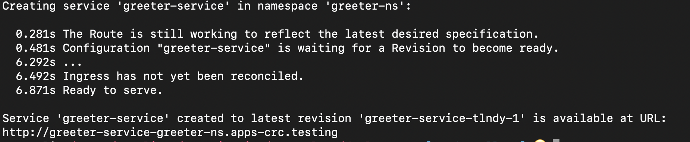

# Blue/Green and Canary Deployments in Serverless
This lab is about deployments in OpenShift Serverless. During the lab we will do a blue/green and canary deployment of a NodeJS application. This lab has been tested using CodeReady Containers in OpenShift 4.5.  Instructions for local development with minikube can be found [here](https://github.com/cmwylie19/minikube-serverless/blob/master/README.md).


The app that we are going to deploy has one endpoint, /greet, which is accessible via a GET request. The greet endpoint returns “hello!” when the environmental variable LANGUAGE is set to “EN”, and “hola!” when LANGUAGE is set to “ES”.   

Below is a picture of the source code of the greet endpoint for reference.   
   
   

The application has been containerized and pushed to an image repository, the image is available [here](quay.io/cmwylie19/node-server).   

## Prereqs
I have installing `wget` listed as a PREREQ in order to simply the process of installing the `kn` cli later on in the lab, this part is _not mandatory_ but will make the installation process easier.   

### Installing `wget`   
_You may need the prefix sudo depeding on whether are you using linux or mac and the distro you are using._   
   
Install `wget` with `dnf`:
```
dnf install wget
```

Install `wget` with `yum`:
```
yum -y install wget
```

Install `wget` with `apt-get`:
```
apt-get install wget
```

Install `wget` with `brew`:
```
brew install wget
```

## Configuring Serverless in OpenShift
We will start by installing Serverless in OpenShift via the OpenShift Serverless Operator. If you are using [minikube](https://gitlab.consulting.redhat.com/appdev-coe/cloud-native-appdev-enablement/serverless-enablement/introduction/-/blob/master/minikube.md) you can skip to the section on installing the knative cli.

### Install the OpenShift Serverless Operator and subscription
```
oc apply -f knative-operator.crc.yaml 
```

### Create a project knative-serving
```
oc new-project knative-serving   
```

### Install the Knative serving operator
```
oc apply -f knative-serving
``` 


## Installing the Knative cli
Knative has a command line tool called `kn` for managing and releasing serverless applications. Below outlines how to install the tool using `wget` and how to install the `wget`  network retriever. If you do not want to install wget you can just download the `kn` binary for your operating system at the end of this section, just make sure you put the binary in your path. 


#### Installing `kn` cli with `wget` for linux
```
wget https://github.com/knative/client/releases/download/v0.16.0/kn-linux-amd64 && mv kn-linux-amd64 kn && chmod 777 kn && sudo mv kn /usr/local/bin/
```

#### Installing `kn` cli with `wget` for mac
```
wget https://storage.googleapis.com/knative-nightly/client/latest/kn-darwin-amd64 && mv kn-linux-amd64 kn && chmod 777 kn && sudo mv kn /usr/local/bin/
```


#### Links for installing `kn` for various operating systems
- [mac](https://storage.googleapis.com/knative-nightly/client/latest/kn-darwin-amd64)
- [linux](https://github.com/knative/client/releases/download/v0.16.0/kn-linux-amd64) 
- [windows](https://storage.googleapis.com/knative-nightly/client/latest/kn-windows-amd64.exe)

In the next section we are going to deploy the image of the node application into the serverless environment.   

## Deploying our NodeJS app image into Serverless
Now it is time to deploy the image of the node application from the container registry into our serverless environment. The first thing we are going to do is create a namespace where our NodeJS Serverless application will live.   

To create the `greeter-ns` you will issue the following command:    

```
oc create namespace greeter-ns
```

On a minikube vm you will use
```
kubectl create namespace greeter-ns
```

Now that we have created the greeter-ns project we are going to deploy the NodeJS application image as a Knative service or ksvc and give the pod running the application a window of 10 seconds to scale back down to 0 if no further requests are recieved.

We are going to use `kn service create`, specifiy the name of the service, the image from which to use to generate the service, and the autoscale window.

``` 
kn service create greeter-service --image quay.io/cmwylie19/node-server --autoscale-window 10s 
```

You should receive output similar to that of the image below. The last line of the output contains a url where the knative service can be accessed.
   
 
   

We are going to test our application by curling against the /greet endpoint of the knative service, we should expect to receive "Hello!".   

```
curl $(kn service list greeter-service | awk 'FNR == 2 { print $2 }')/greet  
```

In the next section we are going to talk about blue green deployments. We will create a brand new knative service identical to the service that we just created, only with a the LANGUAGE environmental variable set to "ES" for spanish.

## Blue/Green Deployment 
Now that we have our application has been released into production we are going to do a blue/green deployment. To help demonstrate the different versions of the application we are going to change the LANGUAGE environmental variable in the container to ES to make the greet endpoint return “hola”  instead of "hello".


### Create a green deployment
```  
kn service create greeter-service-2 --image quay.io/cmwylie19/node-server --env LANGUAGE=ES --autoscale-window 10s 
```

  

Now you are going to make a GET request to the new green version of the application. This time you should get "hola!". 

```
curl $(kn service list greeter-service | awk 'FNR == 2 { print $2 }')/greet
```

Now we have successfully deployed a green version of our OpenShift Serverless application! 

## Canary Deployment
This time we are going to do a canary deployment of the original version of our knative service. Our goal is that 50% of the traffic goes to the container with LANGUAGE set to “EN” and 50% goes to the container with the LANGUAGE set to “ES”.

We will update the greeter-app service to shift 50% of the traffic to the original revision and 50% to the latest revision.
```
kn service update greeter-service --traffic $(kn revision list | awk 'FNR == 2 {print $1}')=50,$(kn revision list | awk 'FNR == 3 {print $1}')=50
```

### Test Our deployment
Now we test our deployment with a shell one-liner   
```
for x in $(seq 20); do curl $(kn service list | awk 'FNR == 2 { print $2 }')/greet; done;
```


Now you have deployed an app in OpenShift Serverless, created a Blue/Green Deployment, and created a Canary Deployment.

### Clean up
On OpenShift
```
oc delete project greeter-ns
```

On minikube
```
kubectl delete ns greet-ns
```

