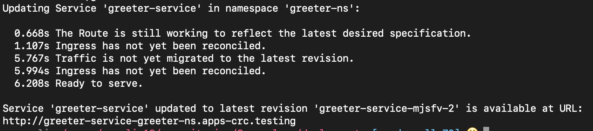

# Blue/Green and Canary Deployments in Serverless
This is an example of doing a blue/green and a canary deployment of a NodeJS application in OpenShift Serverless. This lab is written for OpenShift 4.3

The app has one endpoint, /greet, accessible via a GET request. The greet endpoint returns “hello!” if the environmental variable LANGUAGE is set to “EN”, and “hola!” if LANGUAGE is set to “ES”.   
   
   


This app has been built and pushed to [quay.io](quay.io/cmwylie19/node-server).

### Install the serverless operator
```
$ oc apply -f operator.yaml   
```

### Deploy the serverless operator subscription
```
$ oc apply -f operator-subscription.yaml   
```

### Create a project knative-serving
```
$ oc new-project knative-serving   
```

### Install the Knative serving operator
```
oc apply -f knative-serving
```

### Install the Knative cli
```
wget https://github.com/knative/client/releases/download/v0.16.0/kn-linux-amd64 && mv kn-linux-amd64 kn && chmod 777 kn && sudo mv kn /usr/local/bin/
```
## Deploy our NodeJS app into OpenShift Serverless
### Create a project for our NodeJS Serverless Deployment
```
$ oc new-project node-server-project
```

### Deploy a Knative service
Now that we have a project, lets deploy a Knative service or ksvc from the NodeJS application image in quay image repository 
``` 
$ kn service create node-server --image quay.io/cmwylie19/node-server   
```

Curl against the url in the last line of the terminal output   
   
> curl http://node-server-node-server-project.apps.cluster-xxxx.xxxx.sandbox9.opentlc.com/greet   

That's it!

## Blue/Green Deployment 
Now that we have our application released into production we are going to do a blue/green deployment. To help demonstrate the different versions of the application we are going to change the LANGUAGE environmental variable in the container to ES to make the greet endpoint return “hola” in the new version instead of hello.


### Create a green deployment
```  
$ kn service create node-server-green --image quay.io/cmwylie19/node-server --env LANGUAGE=ES
```

  

### Curl against the green deployment 

> curl http://node-server-green-node-server-project.apps.cluster-xxxx.xxxx.sandbox9.opentlc.com/greet

Now we have successfully deployed a green version of our OpenShift Serverless application!

## Canary Deployment
This time we are going to do a canary deployment of the original version of our knative service. Our goal is that 50% of the traffic goes to the container with LANGUAGE set to “EN” and 50% goes to the container with the LANGUAGE set to “ES”.

### Look at the revisions
> kubectl get revisions   

The idea is that we edit the configuration of the knative service node-server to split 50% of the traffic to original revision(blue), and 50% to the latest revision(green).

### Export the node-server Knative serive to a yaml file,
> kubectl get ksvc/node-server -o yaml > node-server.ksvc.yaml

 
### Update the Name and Traffic
We need to update the ```‘{“spec”:{“template”:{“metadata”:{“name”:”node-server-xxxx-1”}}}}’``` to ```‘{“spec”:{“template”:{“metadata”:{“name”:”node-server-xxxx-2”}}}}’``` and  ```‘{“spec”:{“traffic”}} ```to include 50% of the traffic to the name of the revision that holds the green deployment.

In the end it should look similar to this 


### Apply the changes 
```
$ kubectl apply -f node-server.ksvc.yaml
```

### Get the URL of the Knative Service again
```
$ kubectl get ksvc/node-server`   
```

### Test Our deployment
Now we test our deployment with a shell one-liner   
```
$ for x in $(seq 20); do curl http://node-server-node-server-project.apps.cluster-xxxx.ae24.sandbox9.opentlc.com/greet done
```


Now you have deployed an app in OpenShift Serverless, created a Blue/Green Deployment, and created a Canary Deployment.

### Clean up
> oc delete project node-server-project